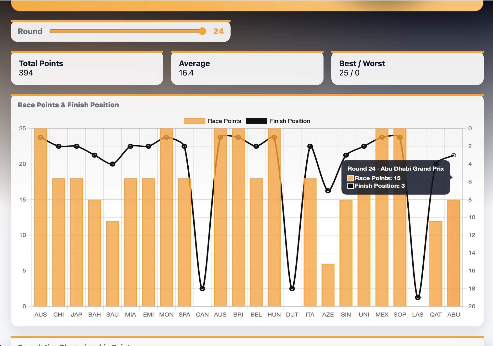

# F1 2025 Race Results Dashboard

## 概要
F1 2025シーズンのレース結果を可視化する  
Webダッシュボードです。

Pythonでレース結果データを取得し、  
JavaScriptでデータの表示・切り替えを行っています。

データ取得処理と表示処理を分離し、  
可読性と拡張性を意識して実装しました。



---

## 使用技術
- HTML / CSS / JavaScript（Vanilla）
- Python 3
- Git / GitHub

---

## ディレクトリ構成
```
├─ index.html
├─ style.css
├─ dashboard.js
├─ data/
│  └─ races_2025.json
├─ scripts/
│  └─ f1_results_data_fetcher.py
└─ assets/
   └─ sample.png
```

---

## 実行方法

### データ取得
```bash
python scripts/f1_results_data_fetcher.py
```

### ローカルでの動作確認
```bash
python -m http.server 8000
```

### ブラウザで以下にアクセスしてください。

```
http://localhost:8000
```

---

## 工夫点
- 見やすさを重視し、情報構造が直感的に分かるよう設計
- 第三者の視点を意識し、ファイル構成と命名を整理


## 注意点
本ページでは、
Main Raceのポイントのみを対象としています。
---

